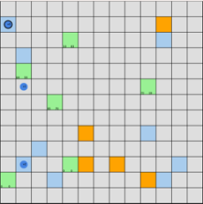
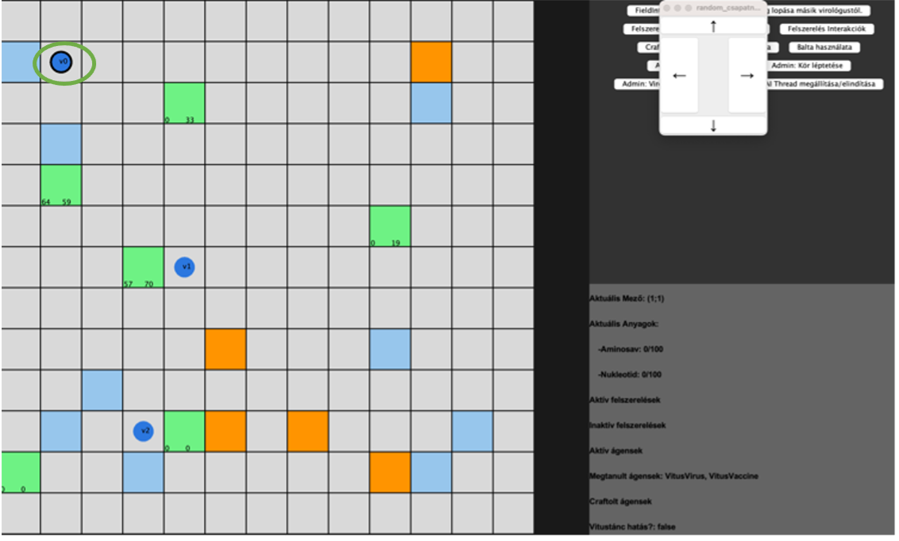
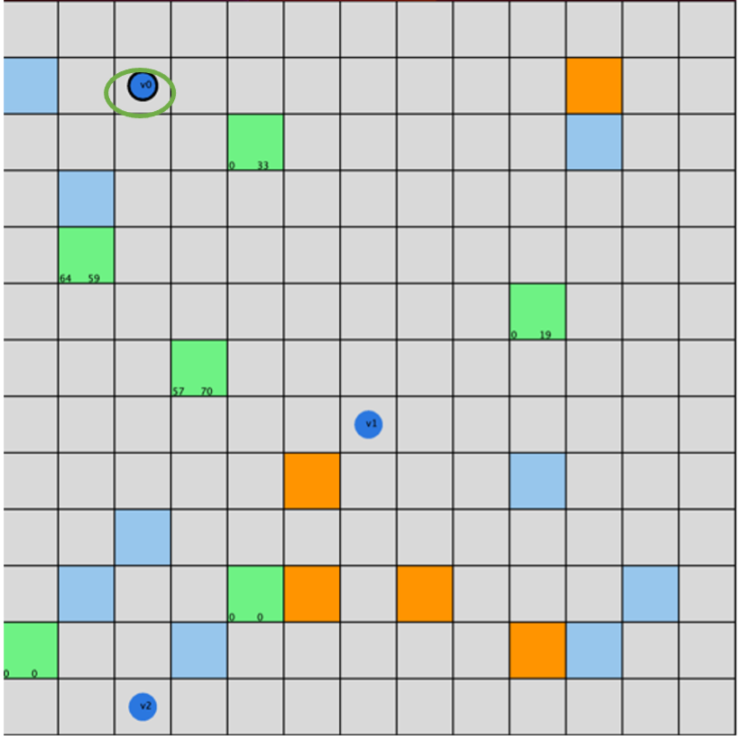
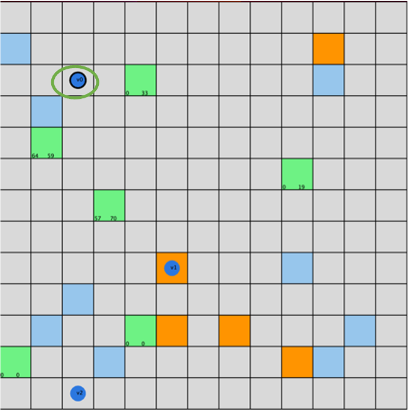
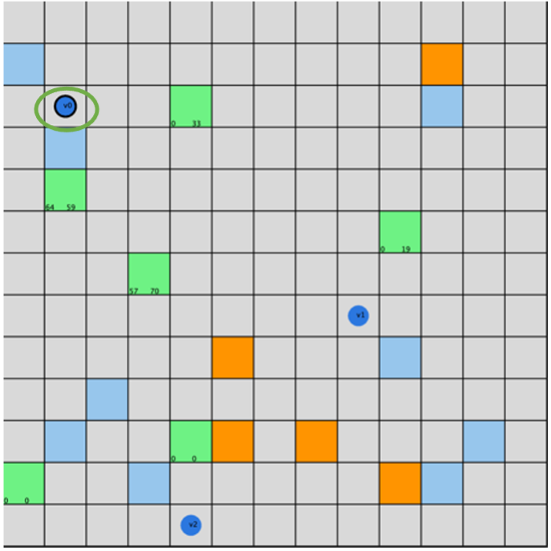
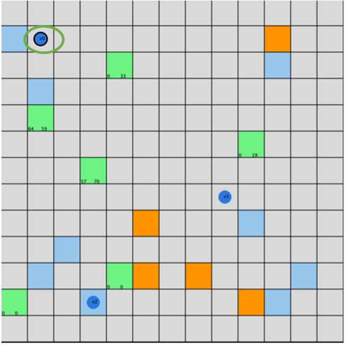

# Manuális tesztelés

 A manuális tesztelés során a cél az, hogy alaposan átvizsgáljuk a játék funkcióit. A manuális tesztek segítségével ellenőrizzük, hogy a játék, illetve a tervezett felhasználói interakciók és funkcionalitások a specifikációnak megfelelően működnek-e.

## Tesztek:

1.	Játék indítása
2.	Felhasználó virológusának mozgatása 
3.	Laboratóriumban genetikai kód megszerzése 
4.	Raktárból anyagok begyűjtése
5.	Ágens létrehozása
6.	Védőfelszerelés megszerzése
7.	Virológusok találkozása 
8.	Anyagkészlet lopása
9.	Felszerelés lopása
10.	Játék vége a genetikai kódok megszerzésével

***

### **1.	Játék indítása:**

Rövid leírás:
- A játékot elindítjuk a fő menüből.

Elvárt eredmény:
- A játék betöltődik, megjelenik a játéktér, rajta a játékosokkal.

Tényleges eredmény:
- A játék sikeresen betöltődött. A játéktér és a játékosok megjelentek.

***

### **2.	Felhasználó virológusának mozgatása :**

Rövid leírás:
- A játékos mozog a játéktéren egy felugró ablakon található nyilak segítségével az egér használatával.

Elvárt eredmény:
- A játékos megfelelően mozog a játéktéren a megadott inputok alapján.

Tényleges eredmény:
- A játékos a megadott inputoknak megfelelően mozog a pályán. A fel, le, jobbra, balra irányú mozgás is működik, a pályáról kilépni nem tud, csak valós mezőkre tud lépni.

Teszt lépései:
1.	Játék indítása
2.	Move gomb megnyomása
3.	A felugró ablakból kiválasztani a kívánt irányt.
4.	2.-3. lépést ismételni mind a 4 irányra

↓ jobbra mozgás

↓ lefele mozgás

↓ balra mozgás

↓ felfele mozgás

