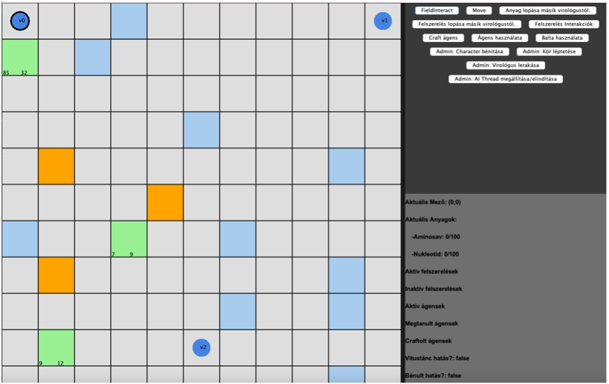
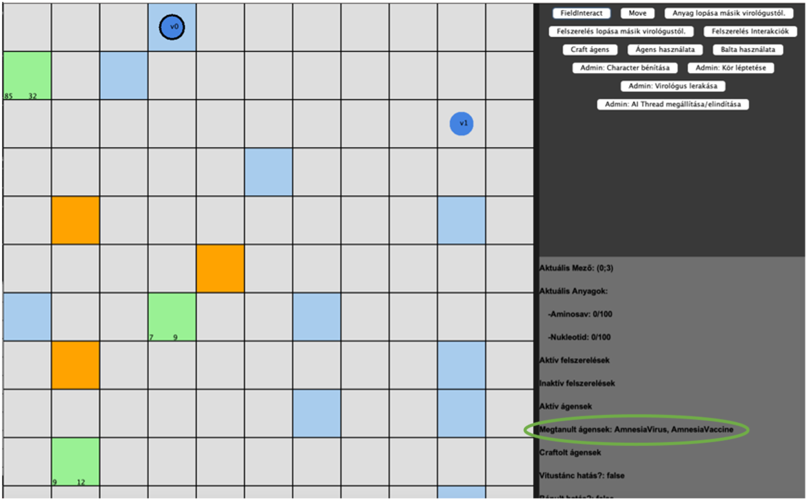
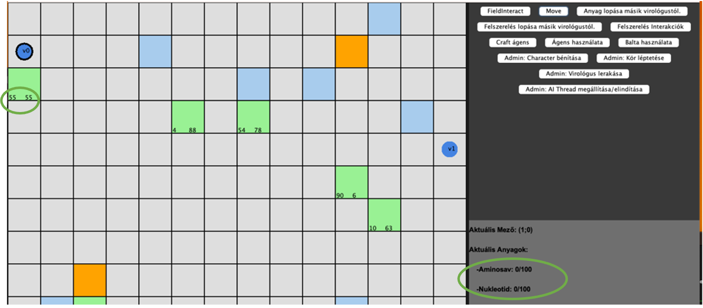
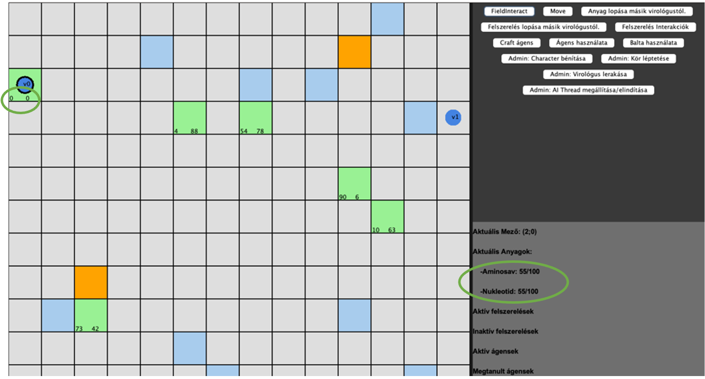
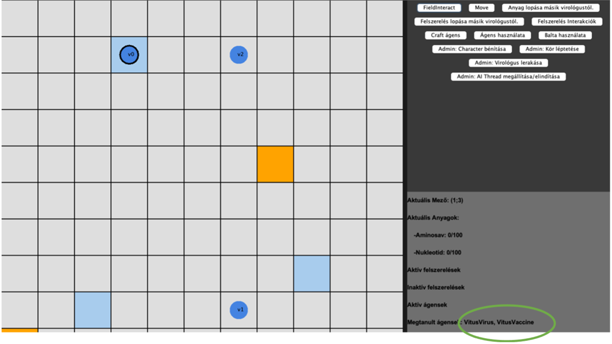
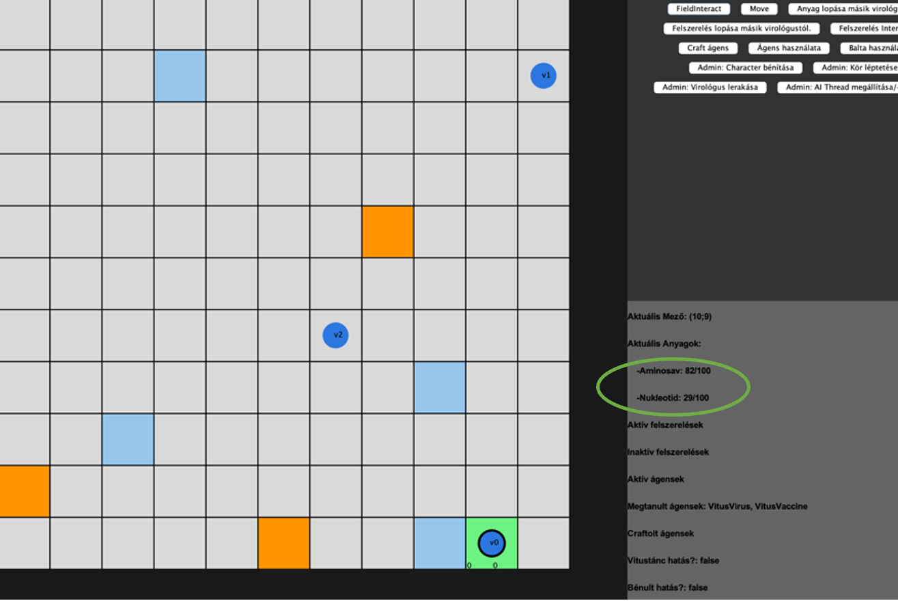
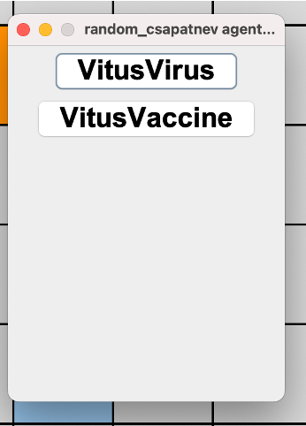
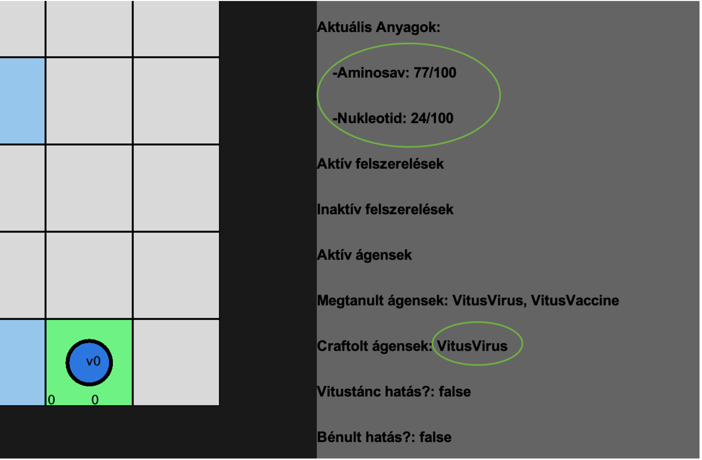

# Manuális tesztelés

 A manuális tesztelés során a cél az, hogy alaposan átvizsgáljuk a játék funkcióit. A manuális tesztek segítségével ellenőrizzük, hogy a játék, illetve a tervezett felhasználói interakciók és funkcionalitások a specifikációnak megfelelően működnek-e.

## Tesztek:

1.	Játék indítása
2.	Felhasználó virológusának mozgatása 
3.	Laboratóriumban genetikai kód megszerzése 
4.	Raktárból anyagok begyűjtése
5.	Ágens létrehozása
6.	Védőfelszerelés megszerzése
7.	Virológusok találkozása 
8.	Anyagkészlet lopása
9.	Felszerelés lopása
10.	Játék vége a genetikai kódok megszerzésével

***

    1.	Játék indítása:

**Rövid leírás:**
- A játékot elindítjuk a fő menüből.

**Elvárt eredmény:**
- A játék betöltődik, megjelenik a játéktér, rajta a játékosokkal.

**Tényleges eredmény:**
- A játék sikeresen betöltődött. A játéktér és a játékosok megjelentek.

***

    2.	Felhasználó virológusának mozgatása :

**Rövid leírás:**
- A játékos mozog a játéktéren egy felugró ablakon található nyilak segítségével az egér használatával.

**Elvárt eredmény:**
- A játékos megfelelően mozog a játéktéren a megadott inputok alapján.

**Tényleges eredmény:**
- A játékos a megadott inputoknak megfelelően mozog a pályán. A fel, le, jobbra, balra irányú mozgás is működik, a pályáról kilépni nem tud, csak valós mezőkre tud lépni.

**Teszt lépései:**
1.	Játék indítása
2.	Move gomb megnyomása
3.	A felugró ablakból kiválasztani a kívánt irányt.
4.	2.-3. lépést ismételni mind a 4 irányra

↓ jobbra mozgás

↓ lefele mozgás

↓ balra mozgás

↓ felfele mozgás

***

    3.	Laboratóriumban genetikai kód megszerzése

**Rövid leírás:**
- A játékos belép a laboratóriumba és letapogatja a genetikai kódot.

**Elvárt eredmény:**
- A játékos sikeresen megszerzi a genetikai kódot a laboratóriumban.

**Tényleges eredmény:**
- A játékos sikeresen megszerzi a genetikai kódot a laboratóriumban. Ezt a játéktér mellett jobb oldalon láthatja is a „Megtanult ágensek” felirat mellett.

**Teszt lépései:**
1.	Játék indítása
2.	Labor mezőre navigálás
3.	Interaktálás a mezővel (FieldInteract gomb)

Játékindítás utáni kezdőállapot. Nem rendelkezik semmivel a játékos, megtanult ágensek is üres.

Laborra lépés (kék mező), majd azzal való interaktálás után, a játékosnál megjelennek a megtanult ágensek.

***

    4.	Raktárból anyagok begyűjtése    

**Rövid leírás:**
- A játékos begyűjt anyagokat a raktárból.

**Elvárt eredmény:**
- A játékos sikeresen begyűjt anyagokat a raktárból, miután interaktál egy raktár típusú mezővel, feltéve, hogy van rajta anyag.

**Tényleges eredmény:**
- A játékos sikeresen begyűjt anyagokat a raktárból, feltéve, hogy van rajta anyag. Az interakció eredményét a játéktér mellett jobboldalt láthatja.

**Teszt lépései:**
1.	Játék indítása
2.	Labor mezőre navigálás
3.	Interaktálás a mezővel (FieldInteract gomb)

A felvétel előtti állapot. Üres az aktuális anyagok rész a jobboldalon. A zöld mező a raktár. Alsó indexében látható, hogy hány aminosav és hány nukleotid található rajta. Max mennyiség mindkettőből 100. Teszteltem, hogy többet egyikből sem enged felvenni a rendszer.

Felvétel utáni állapot. A felvett mennyiséget a mezőről levonja, a játékoshoz hozzáadja.

***

    5.	Ágens létrehozása   
**Rövid leírás:**
- A játékos létrehoz egy ágenst.

**Elvárt eredmény:**
- A játékos sikeresen létrehoz egy ágenst a megszerzett kód és anyagok alapján. Erről visszajelzést kap a képernyőn.

**Tényleges eredmény:**
- A játékos sikeresen létrehoz egy ágenst a megszerzett kód és anyagok alapján.

**Teszt lépései:**
1.  Játék indítása
2.	Laborra lépés
3.	Interakció a laborral, kód begyűjtése
4.	Raktárra lépés
5.	Interakció a raktárral, anyag begyűjtése
6.	Ha van elég anyag, akkor ágens kreálása, ha nincs, akkor 4.-5. lépés ismétlése

Laborra (kék mező) lépés, kód letapogatása.

Raktárra lépés, anyagok begyűjtése.

Ágens készítése, „Craft ágens” gomb, ekkor egy felugró ablakban kiválasztjuk, hogy vírust vagy vakcinát szeretnénk létrehozni.

A választás után a „Craftolt ágensek” -nél megjelenik a kiválasztott ágens. Az „aktuális anyagok”-ból levonásra kerül az adott ágenshez szükséges anyagmennyiség. Amennyiben nem áll rendelkezésre az ágens létrehozásához szükséges anyagmennyiség, a rendszer nem engedi az ágens létrehozását.

