# Manuális tesztelés

 A manuális tesztelés során a cél az, hogy alaposan átvizsgáljuk a játék funkcióit. A manuális tesztek segítségével ellenőrizzük, hogy a játék, illetve a tervezett felhasználói interakciók és funkcionalitások a specifikációnak megfelelően működnek-e.

## Tesztek:

1.    Játék indítása
2.    Felhasználó virológusának mozgatása 
3.    Laboratóriumban genetikai kód megszerzése 
4.    Raktárból anyagok begyűjtése
5.    Ágens létrehozása
6.    Védőfelszerelés megszerzése
7.    Virológusok találkozása 
8.    Anyagkészlet lopása
9.    Felszerelés lopása
10.    Játék vége a genetikai kódok megszerzésével

***

    1. Játék indítása:

**Rövid leírás:**
- A játékot elindítjuk a fő menüből.

**Elvárt eredmény:**
- A játék betöltődik, megjelenik a játéktér, rajta a játékosokkal.

**Tényleges eredmény:**
- A játék sikeresen betöltődött. A játéktér és a játékosok megjelentek.

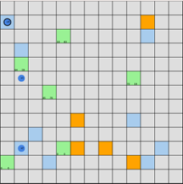

***

    2. Felhasználó virológusának mozgatása:

**Rövid leírás:**
- A játékos mozog a játéktéren egy felugró ablakon található nyilak segítségével az egér használatával.

**Elvárt eredmény:**
- A játékos megfelelően mozog a játéktéren a megadott inputok alapján.

**Tényleges eredmény:**
- A játékos a megadott inputoknak megfelelően mozog a pályán. A fel, le, jobbra, balra irányú mozgás is működik, a pályáról kilépni nem tud, csak valós mezőkre tud lépni.

**Teszt lépései:**
1.    Játék indítása
2.    Move gomb megnyomása
3.    A felugró ablakból kiválasztani a kívánt irányt.
4.    2.-3. lépést ismételni mind a 4 irányra

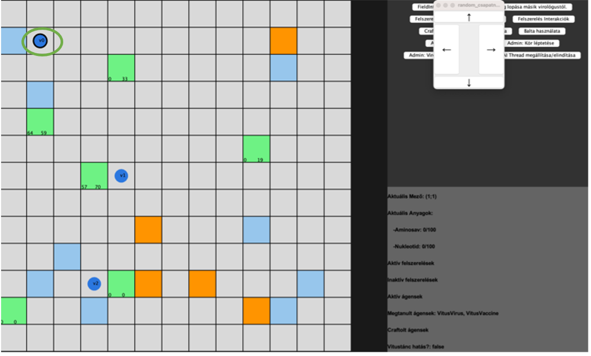

 Jobbra mozgás  &rarr;
 
 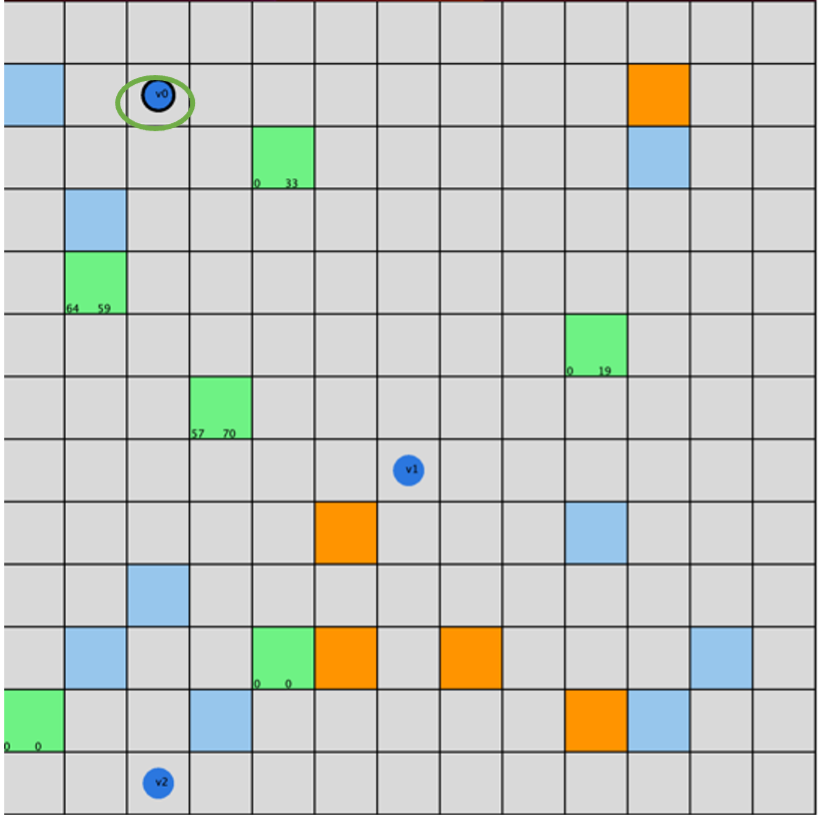
 
 Lefele mozgás  &darr;

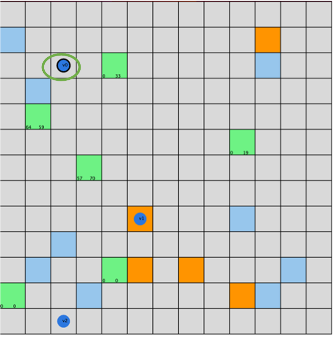

Balra mozgás  &larr;

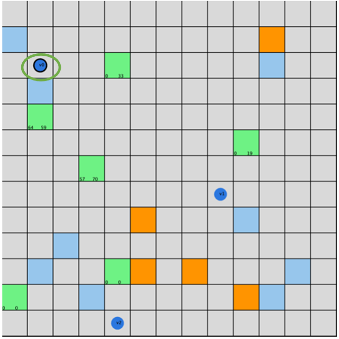

Felfele mozgás  &uarr;

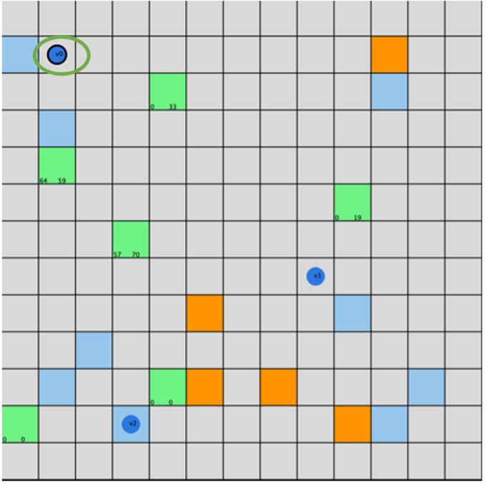

***

    3. Laboratóriumban genetikai kód megszerzése

**Rövid leírás:**
- A játékos belép a laboratóriumba és letapogatja a genetikai kódot.

**Elvárt eredmény:**
- A játékos sikeresen megszerzi a genetikai kódot a laboratóriumban.

**Tényleges eredmény:**
- A játékos sikeresen megszerzi a genetikai kódot a laboratóriumban. Ezt a játéktér mellett jobb oldalon láthatja is a „Megtanult ágensek” felirat mellett.

**Teszt lépései:**
1.    Játék indítása
2.    Labor mezőre navigálás
3.    Interaktálás a mezővel (FieldInteract gomb)

Játékindítás utáni kezdőállapot. Nem rendelkezik semmivel a játékos, megtanult ágensek is üres.

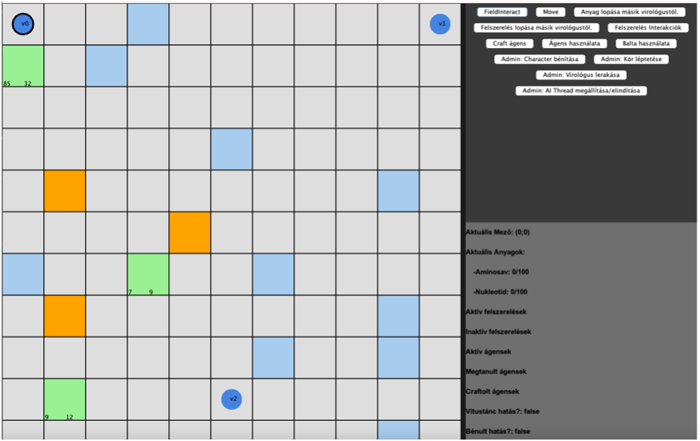

Laborra lépés (kék mező), majd azzal való interaktálás után, a játékosnál megjelennek a megtanult ágensek.

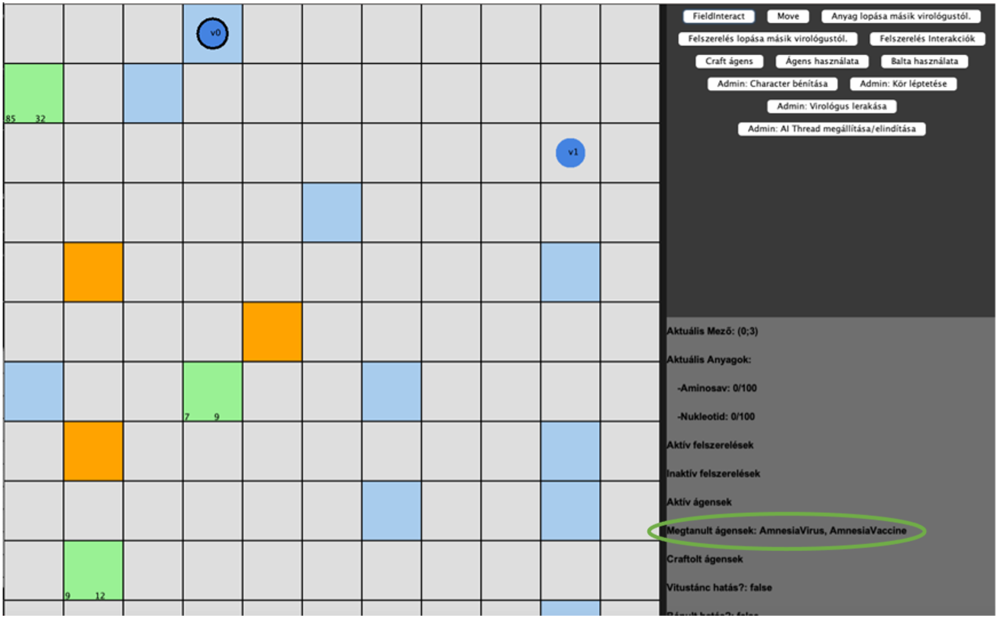

***

    4. Raktárból anyagok begyűjtése    

**Rövid leírás:**
- A játékos begyűjt anyagokat a raktárból.

**Elvárt eredmény:**
- A játékos sikeresen begyűjt anyagokat a raktárból, miután interaktál egy raktár típusú mezővel, feltéve, hogy van rajta anyag.

**Tényleges eredmény:**
- A játékos sikeresen begyűjt anyagokat a raktárból, feltéve, hogy van rajta anyag. Az interakció eredményét a játéktér mellett jobboldalt láthatja.

**Teszt lépései:**
1.    Játék indítása
2.    Labor mezőre navigálás
3.    Interaktálás a mezővel (FieldInteract gomb)

A felvétel előtti állapot. Üres az aktuális anyagok rész a jobboldalon. A zöld mező a raktár. Alsó indexében látható, hogy hány aminosav és hány nukleotid található rajta. Max mennyiség mindkettőből 100. Teszteltem, hogy többet egyikből sem enged felvenni a rendszer.

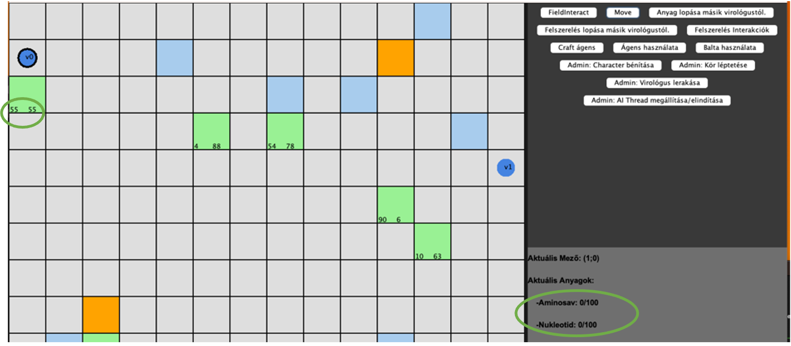

Felvétel utáni állapot. A felvett mennyiséget a mezőről levonja, a játékoshoz hozzáadja.

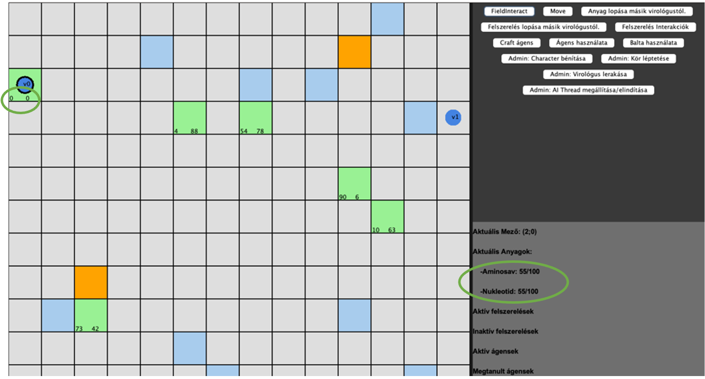

***

    5. Ágens létrehozása   
**Rövid leírás:**
- A játékos létrehoz egy ágenst.

**Elvárt eredmény:**
- A játékos sikeresen létrehoz egy ágenst a megszerzett kód és anyagok alapján. Erről visszajelzést kap a képernyőn.

**Tényleges eredmény:**
- A játékos sikeresen létrehoz egy ágenst a megszerzett kód és anyagok alapján.

**Teszt lépései:**
1.  Játék indítása
2.    Laborra lépés
3.    Interakció a laborral, kód begyűjtése
4.    Raktárra lépés
5.    Interakció a raktárral, anyag begyűjtése
6.    Ha van elég anyag, akkor ágens kreálása, ha nincs, akkor 4.-5. lépés ismétlése

Laborra (kék mező) lépés, kód letapogatása.

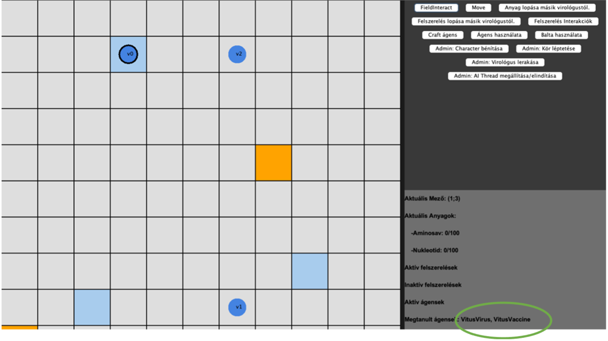

Raktárra lépés, anyagok begyűjtése.

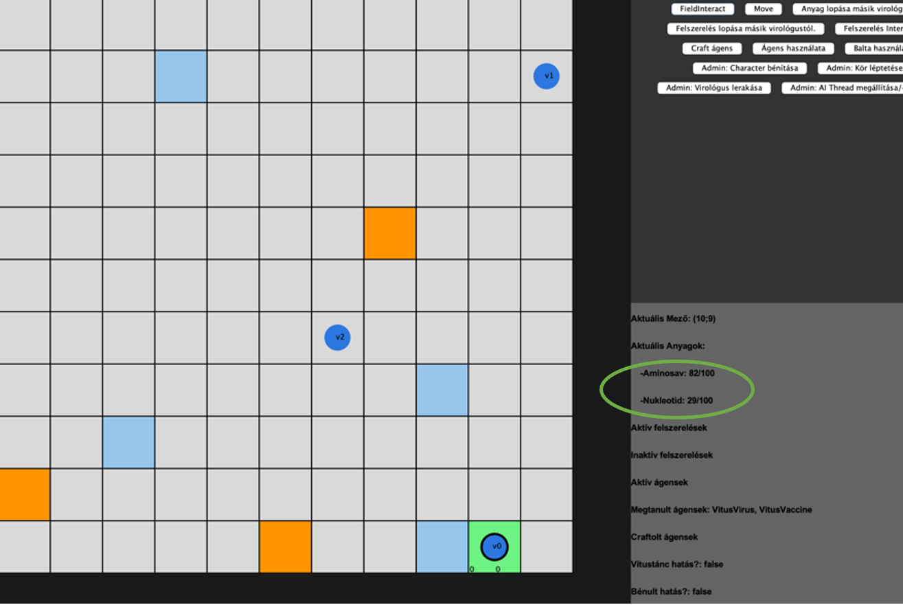

Ágens készítése, „Craft ágens” gomb, ekkor egy felugró ablakban kiválasztjuk, hogy vírust vagy vakcinát szeretnénk létrehozni.

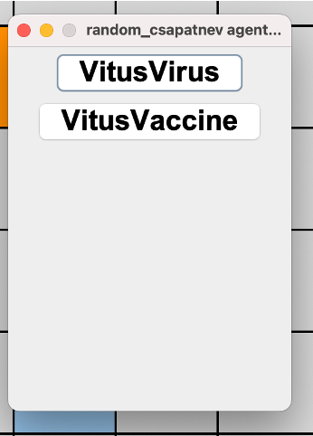

A választás után a „Craftolt ágensek” -nél megjelenik a kiválasztott ágens. Az „aktuális anyagok”-ból levonásra kerül az adott ágenshez szükséges anyagmennyiség. Amennyiben nem áll rendelkezésre az ágens létrehozásához szükséges anyagmennyiség, a rendszer nem engedi az ágens létrehozását.

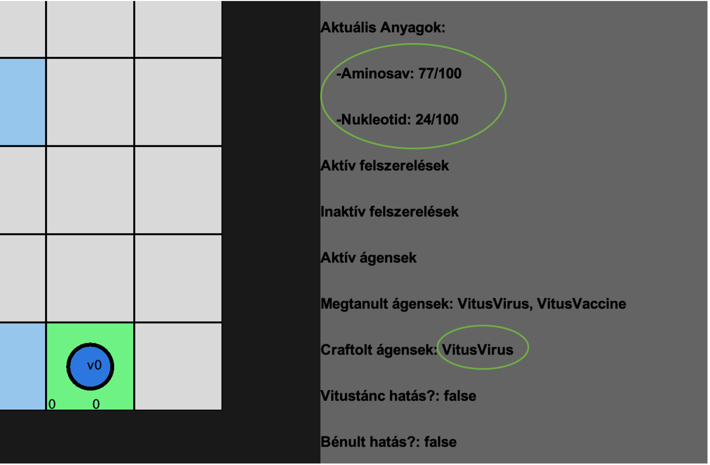

***

    6. Védőfelszerelés megszerzése   
**Rövid leírás:**
- A játékos megszerzi a védőfelszerelést az óvóhelyen.

**Elvárt eredmény:**
- A játékos sikeresen megszerzi a védőfelszerelést az óvóhelyen.

**Tényleges eredmény:**
- A játékos sikeresen megszerzi a védőfelszerelést az óvóhelyen
Erről visszajelzést kap a képernyőn.

**Teszt lépései:**
1.    Játék indítása
2.    Óvóhelyre navigálás
3.    Interakció a mezővel

Kezdőállapot, még nincs védőfelszerelés.

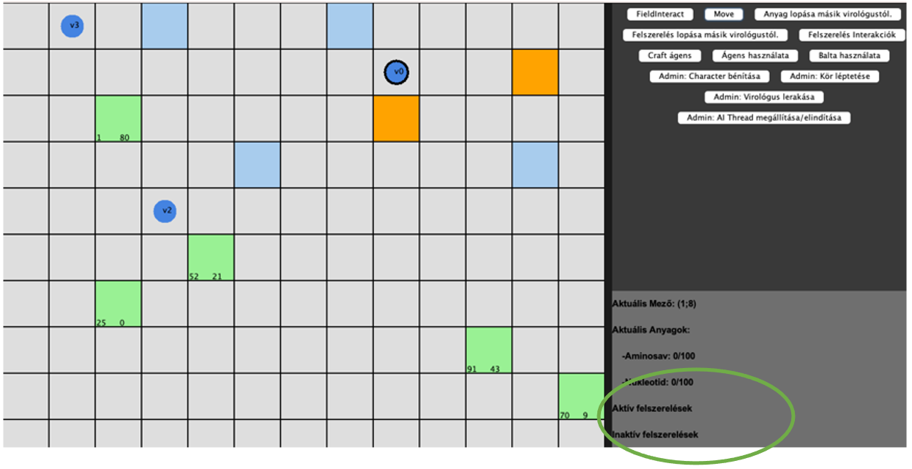

Óvóhelyre navigálás, interakció a mezővel. Az adott mezőn lévő felszerelés felvétele, visszajelzés adása a képernyőn. Ugyanazon mezővel kapcsolatos újabb interakció hatására helyesen nem történik semmi.

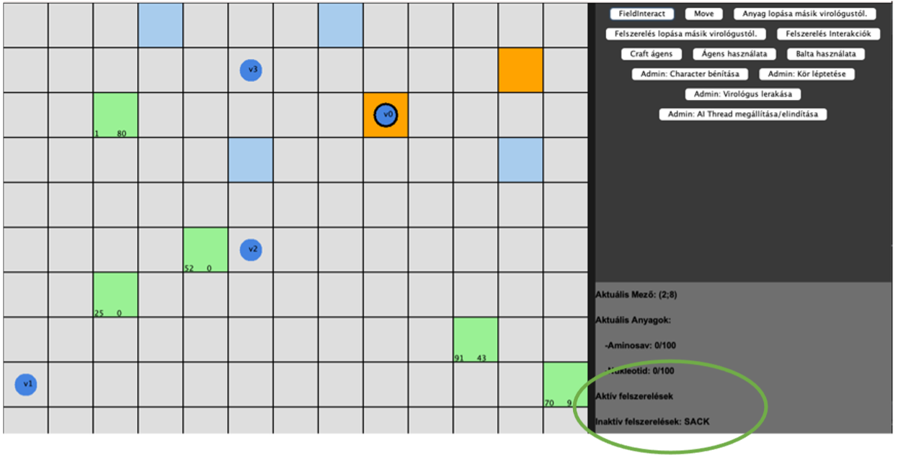

Másik óvóhelyen történő interakció során helyesen felvételre kerül egy újabb felszerelés.

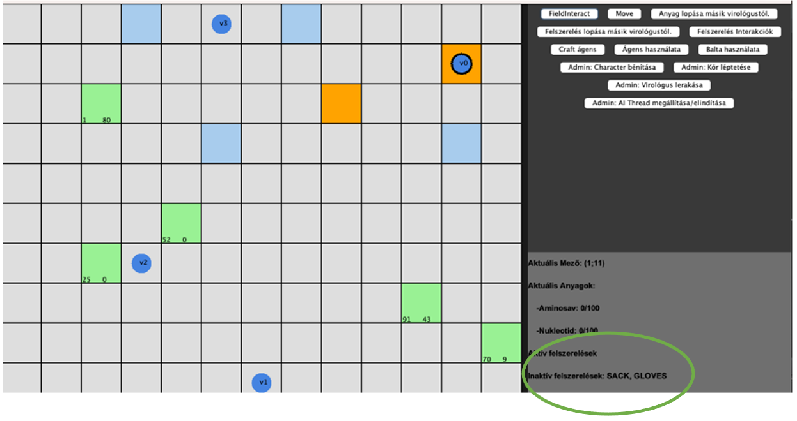

***
 
    7. Virológusok találkozása
**Rövid leírás:**
- Ellenőrizzük, hogy a játék megfelelően kezeli a virológusok találkozását a játéktéren.

**Elvárt eredmény:**
- Ha legalább egy másik virológussal ugyanazon a mezőn áll a játékos karaktere, akkor a másik virológus intraktálására használatos gombok használata esetén egy felugró ablakot kell látnunk, amiben kiválasztható az adott mezőn álló virológusok közül egy, akire érvényesíteni szeretnénk az adott gomb hatását.

**Tényleges eredmény:**
- Ha több virológus is egy mezőn áll, akkor megjelenik az elvárt ablak, ahol kiválaszthatjuk, az interaktálni kívánt virológust.  

**Teszt lépései:**
1.    Játék indítása
2.    Egy másik virológussal egy mezőre lépni
3.    „Anyag lopása másik virológustól” gomb használata

A képen létható állásban a v1 virológussal léptem egy mezőre, majd az „Anyag lopása másik virológustól” gomb hatására megjelent az elvárt ablak, a helyes adatokkal.
Amennyiben nincs másik virológus a játékos mezőjén, akkor nem jelenik meg ez az ablak a gombok megnyomásának hatására.

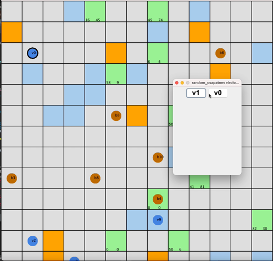

***
 
    8. Anyagkészlet lopása
**Rövid leírás:**
- Ellenőrizzük, hogy a játék megfelelően kezeli, ha a játékos egy másik virológustól anyagot próbál lopni.

**Elvárt eredmény:**
- Ha két virológus sikeresen találkozik és az egyik megpróbálja ellopni az anyagokat a másiktól, akkor a játék megfelelően kezeli a lopási kísérletet és végrehajtja a szükséges interakciókat.

**Tényleges eredmény:**
- A lopási kísérlet nem sikerül, a játék nem mozdítja át az anyagokat a játékos virológusának a készlete közé.  

**Teszt lépései:**
1.    Játék indítása
2.    A játékos irányítja az egyik virológust, a másik virológus pedig véletlenszerűen mozog a pályán. 
3.    Az véletlenszerűen mozgó virológus rendelkezik anyagokkal a készletében. 
4.    A két virológus olyan mezőre lép, ahol találkoznak.
5.    Az irányított virológus megpróbálja ellopni az anyagokat a másik virológus készletéből.

A felugró ablak sikeresen megjelenik, viszont a megtámadott virológus kiválasztása után nem történik meg az anyagnak az átmozgatása a játékos virológusának a készletébe.

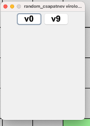

***

    9. Felszerelés lopása
**Rövid leírás:**
- Ellenőrizzük, hogy a játék megfelelően kezeli, ha a játékos egy másik virológustól felszerelést próbál lopni.

**Elvárt eredmény:**
- Ha két virológus sikeresen találkozik és az egyik megpróbál ellopni egy felszerelést a másiktól, akkor a játék megfelelően kezeli a lopási kísérletet és végrehajtja a szükséges interakciókat.

**Tényleges eredmény:**
- A lopási kísérlet nem sikerül, a játék nem mozdítja át a felszerelést a játékoshoz. 

**Teszt lépései:**
1.    Játék indítása
2.    A játékos irányítja az egyik virológust, a másik virológus pedig véletlenszerűen mozog a pályán. 
3.    Az véletlenszerűen mozgó virológus rendelkezik védőfelszereléssel. 
4.    A két virológus olyan mezőre lép, ahol találkoznak.
5.    Az irányított virológus megpróbálja ellopni a védőfelszerelést a másik virológus készletéből.

A felugró ablak sikeresen megjelenik, viszont a megtámadott virológus kiválasztása után nem történik meg a védőfelszerelés átmozgatása a játékos virológusához.

***

    10. Játék vége a genetikai kódok megszerzésével
**Rövid leírás:**
- Ellenőrizzük, hogy a játék megfelelően értékeli és jelzi a játék végét, amikor egy virológus megszerzi az összes genetikai kódot.

**Elvárt eredmény:**
- Ha egy virológus sikeresen megszerzi az összes genetikai kódot, a játék megfelelően értékeli és jelzi a győzelmet.

**Tényleges eredmény:**
- A játékos virológusa sikeresen megszerezte az összes genetikai kódot, a játék helyesen értékelte és jelentette a győzelmet.

**Teszt lépései:**
1.    Játék indítása
2.    A játékos irányítja a virológusát a játéktéren. 
3.    A játékos elmozdul a laboratórium mezőkre, ahol lehetősége van genetikai kódokat megszerezni.
4.    A virológus megszerzi az összes genetikai kódot a laboratórium mezőkről.
5.    A játék ellenőrzi, hogy valóban minden genetikai kódot megszereztek-e.
6.    Ha a virológus sikeresen megszerezte az összes genetikai kódot, a játék jelzi a győzelmet és befejezi a játékot.

Elkezdtem bejárni az összes laboratóriumot (kék mezők) és interaktáltam velük, hogy begyűjtsem a kódokat.

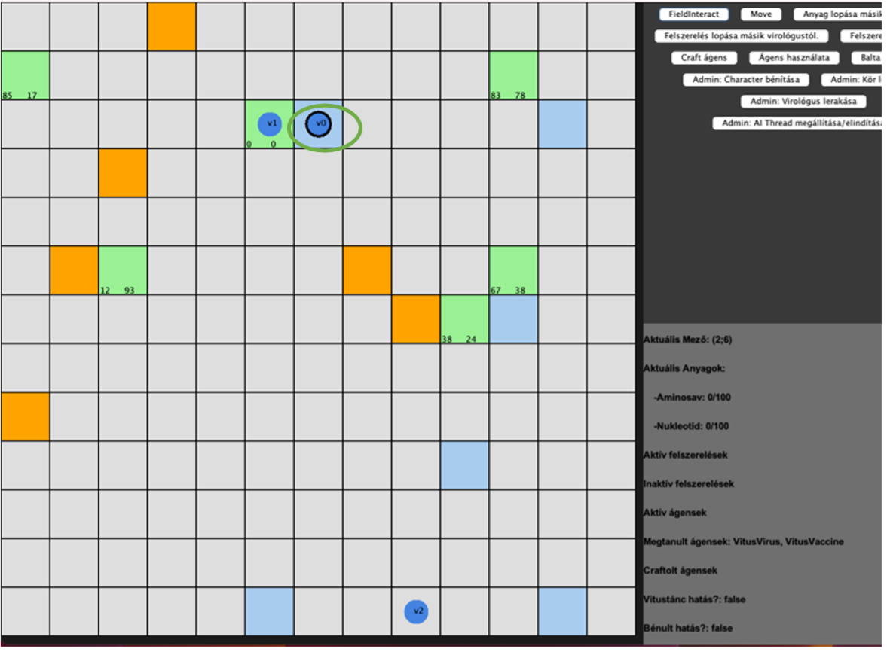

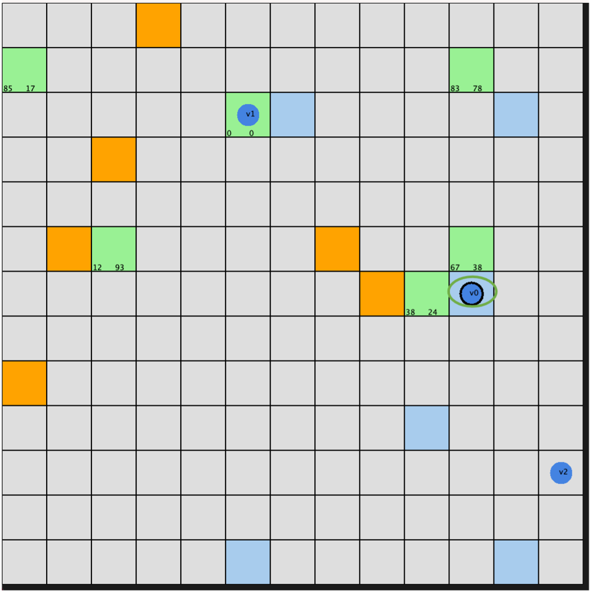

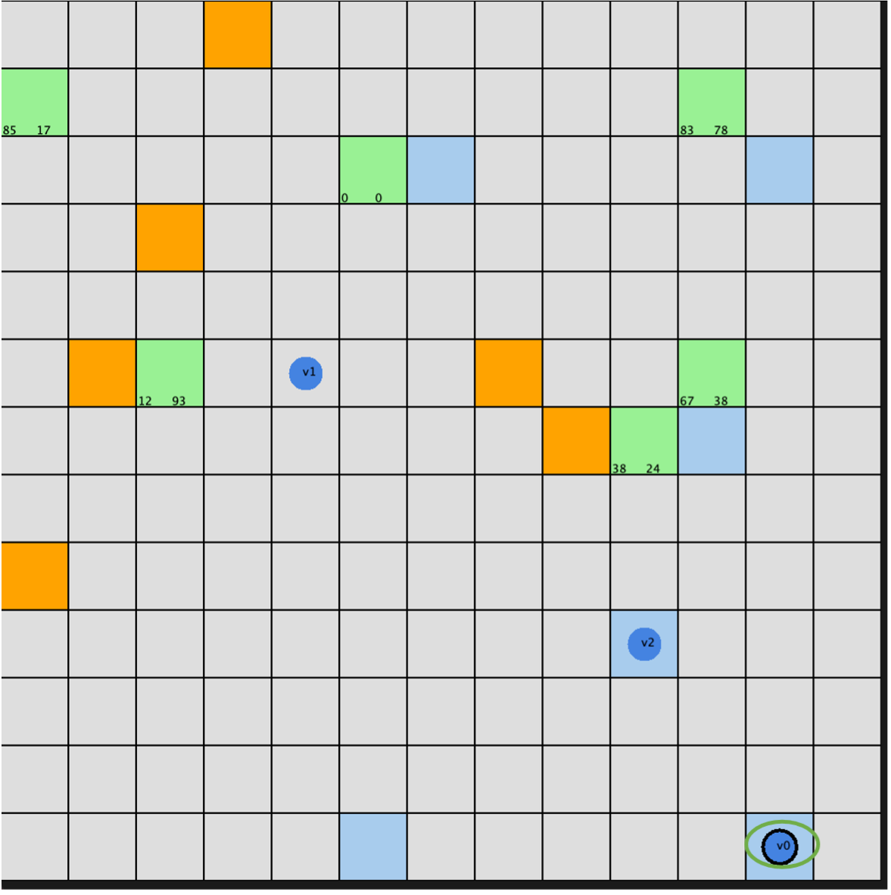

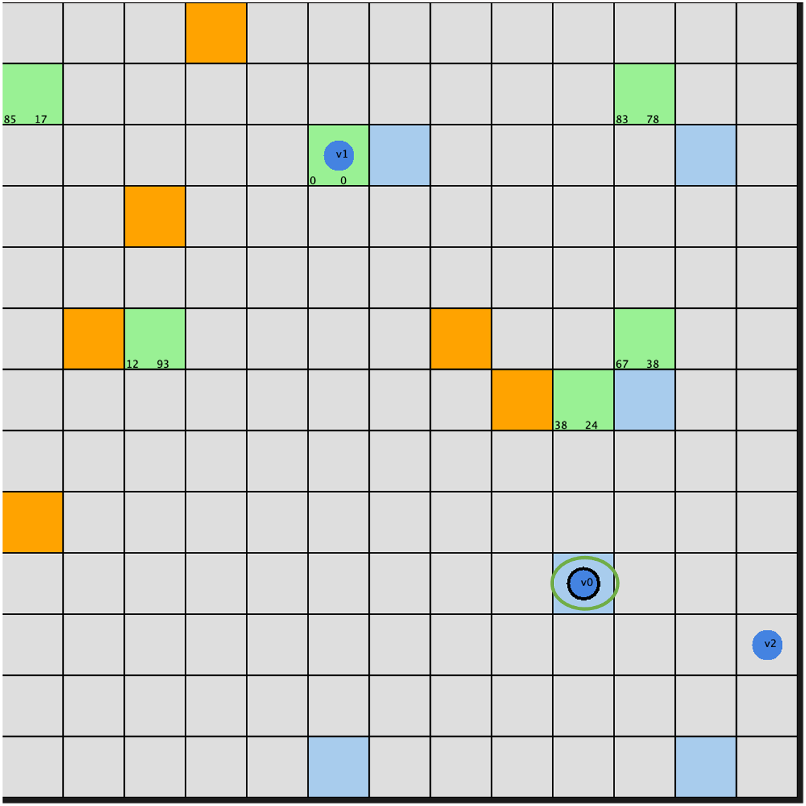

Miután minden genetikai kódot letapogattam, a program ezt „Victory!” felirattal jelzi. 
Amennyiben nem a felhasználó, hanem egy másik virológus nyerni a játékot, akkor a „Game Over!” felirat jelenik meg egy felugró ablakban.

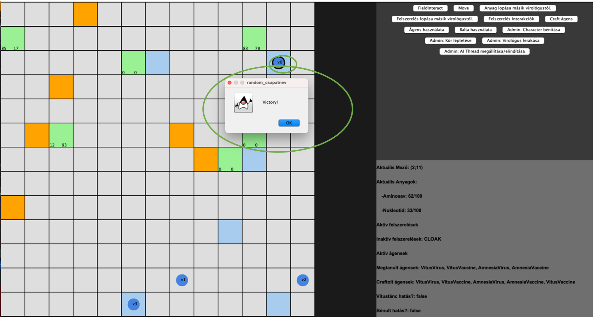

Amennyiben nem a felhasználó, hanem egy másik virológus nyerni a játékot, akkor a „Game Over!” felirat jelenik meg egy felugró ablakban.

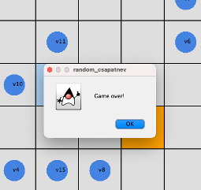
