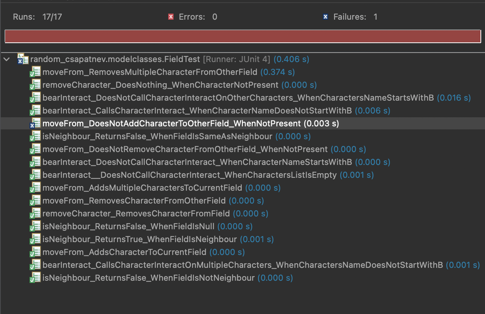
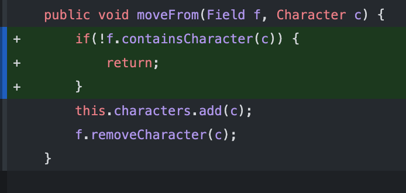
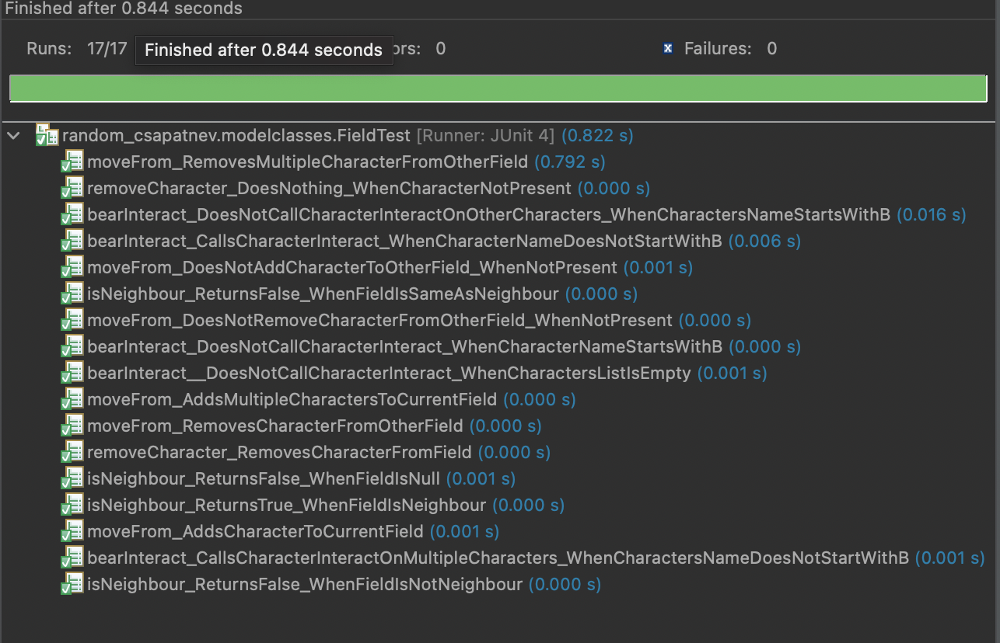
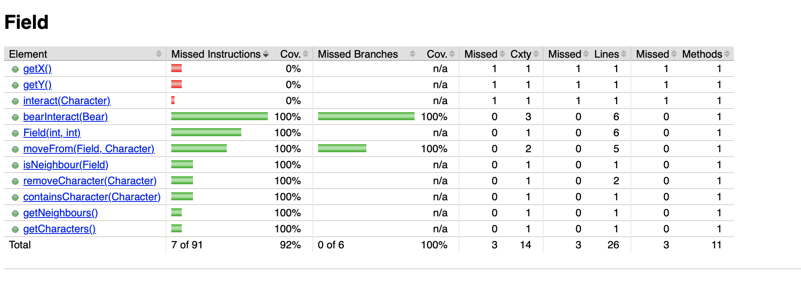

# Unit tesztelés

A feladat során próbáltam a játék működése szempontjából fontos osztályokat kiválasztani és azok függvényeit tesztelni. A teszteket igyekeztem úgy megérni, hogy a lehető legtöbb, szélsőséges forgatókönyv esetére is legyenek tesztek.

    1. Field osztály

Ebben az osztályban 4 függvényre írtam unit teszteket: 

1. isNeighbour
2. bearInteract
3. removeCharacter
4. moveFrom

A 17 teszt közül 16 sikeres eredménnyel járt, a "moveFrom" metódus egyik edge-case tesztje jelzett hibát.

A forráskódot kiegészítettem egy extra feltétellel.

 
 Így már sikeresen fut minden teszt.

JaCoCo a Field osztály esetén: 

    2. Virologist osztály

Ebben az osztályban 2 függvényre írtam unit teszteket:

1. move
2. use

Mind a 6 teszt sikeresen lefutott.

